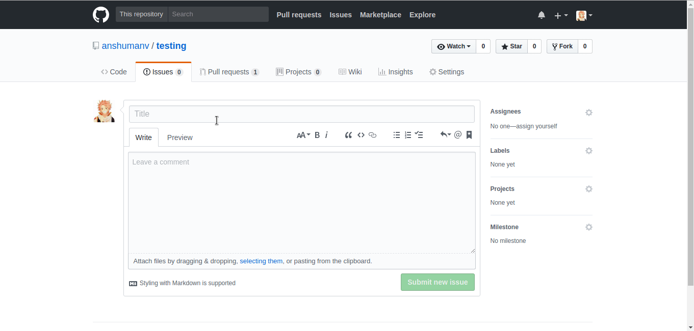

<p align="center">
		
</p>
<h1 align="center">
	issue-type-label
</h1>

> a GitHub App to automatically label issues based on the title.


See [docs/deploy.md](docs/deploy.md) if you would like to run your own instance of this app.


## Demo



## Development
- Clone repo
  ```
  git clone git@github.com:anshumanv/issue-type-label.git
  cd issue-type-label
  npm install
  ```
- Create your own GitHub app: [instructions](https://probot.github.io/docs/development/#configure-a-github-app)
- Store the private key as `private-key.pem` in the repository’s directory
- Start the app with `APP_ID=1234 npm start` where `1234` is your GitHub App’s ID
- update your GitHub App’s `Webhook URL` to your localtunnel.me URL

## Author

Anshuman Verma

[](https://twitter.com/Anshumaniac12)
[](https://linkedin.com/in/anshumanv12)
[](https://github.com/anshumanv)

## Contribute
Found a bug, please [create an issue](https://github.com/anshumanv/issue-type-label/issues/new)

## License

[](https://github.com/anshumanv/issue-type-label/blob/master/LICENSE)
> © Anshuman Verma
